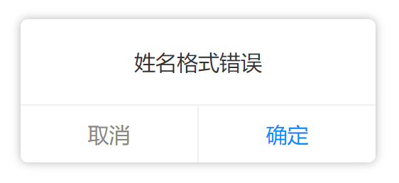

# cl-util 
#### 公共开发基础库 [API文档](http://frontend.git.chelun.io/cl-util) | [更新日志](http://git.chelun.com/frontend/cl-util/blob/master/CHANGELOG.md)  
#### react常用hooks [测试demo文档](http://wap-test.chelun.com/common/tb-test/index.html?path=/story/hooks-useeffectonce--default)
#### [骨架组件文档](./src/ContentLoader/index.md) | [预渲染方案](./src/ContentLoader/预渲染.md)

## 安装

```bash
yarn add git+ssh://git@git.chelun.com:frontend/cl-util.git
```

或

```bash
npm install git+ssh://git@git.chelun.com:frontend/cl-util.git
```

## 开发

`watch` 模式会监听文件变化并自动编译`ts`和`scss`文件

```bash
yarn watch
```

## 编译

```bash
yarn build
```


# 组件和功能


下面列举`cl-util`包所包含的全部功能：

## `Alert` 组件

[☛ 查看组件签名](./lib/Alert/index.d.ts)


<div></div>

### 使用 

```javascript
// 导入组件和对应的css
import "cl-util/Alert/index.css";
import Alert from "cl-util/Alert";

// 方式1：取代原生的window.alert
Alert("姓名格式错误");

// 方式2：可简单定制的弹框
Alert({
  content: string; // 必选，弹框内容
  showCancel?: boolean; // 可选，是否显示取消按钮
  cancelText?: string; // 可选，取消按钮文本
  confirmText?: string; // 可选，确定按钮文本
  onConfirm?: () => void; // 可选，确定按钮回调
  onCancel?: () => void; // 可选，取消按钮回调
})
```

## `Loading` 组件

[☛ 查看组件签名](./lib/Loading/index.d.ts)

显示一个加载状态的动画，默认位于屏幕中间，加载状态会遮挡屏幕操作

<div></div>

### 使用

```javascript
// 导入组件和对应的css
import "cl-util/Loading/index.css";
import Loading from "cl-util/Loading";

// 创建一个加载状态
const loading = new Loading();

// 销毁之前创建的加载状态
loading.destroy();
```


## `Toast` 组件

[☛ 查看组件签名](./lib/Toast/index.d.ts)

淡入淡出一个`toast`提示，默认显示3秒，时间可定制

```javascript
// 导入组件和对应的css
import "cl-util/Toast/index.css";
import Toast from "cl-util/Toast";

// 弹出toast，默认停留3秒
new Toast('成功关注');

// 弹出toast并指定toast的停留时间为5秒
new Toast('成功关注', 5000);
```

## 基础功能

- [☛ index 签名](./lib/index.d.ts)：`import cl-util from "cl-util"`
- [☛ jsBridge 签名](./lib/jsBridge.d.ts)：`import jsBridge from "cl-util/lib/jsBridge"`
- [☛ is 签名](./lib/is.d.ts)：`import is from "cl-util/lib/is"`
- [☛ cookie 签名](./lib/cookie.d.ts)：`import cookie from "cl-util/lib/cookie"`

## TODO

待定...
